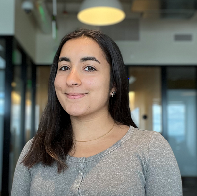

# Future Attorney and Advocate

I'm Sanjana Kaicker, a dual-degree J.D/M.A. student at Boston University School of Law/Pardee School of Global Studies. Two of my particular interests are international trade law and food law & policy.

I am fortunate to be working with [Professor Weijia Rao](https://www.bu.edu/law/profile/weijia-rao/) on a variety of international trade projects, including a comprehensive analysis of nations' negotiation power in ISDS reform. This past summer, I also served as a research intern at Harvard Law School's [Food Law and Policy Clinic](https://chlpi.org/food-law-and-policy/) (a dream come true!), where I got to do deep dives in prominent food systems justice issues and actively shape the food waste policy landscape.

Before law school, I worked as a Senior Associate at [Ankura Consulting Group](https://ankura.com/services/healthcare-disputes), where I conducted data-driven analysis in high-stakes healthcare disputes, collaborating with top law firms and leading experts on payor–provider litigation and pharmacy pricing investigations.

Fun fact: I am a huge advocate of the em dash, and it's quite a shame that it has become associated with AI-produced content!

---

© 2026 Sanjana Kaicker. All rights reserved.

Contact me:

  <a href="mailto:kaickersanjana@gmail.com" title="Email" class="icon-email">
    <i class="fas fa-envelope"></i>
  </a>
  <a href="https://linkedin.com/in/sanjanakaicker" title="LinkedIn" class="icon-linkedin">
    <i class="fab fa-linkedin"></i>
  </a>
  <a href="https://github.com/skaicker" title="GitHub" class="icon-github">
    <i class="fab fa-github"></i>
  </a>

