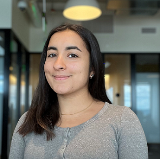

# Future Attorney. Former Economic Consultant.

I'm Sanjana Kaicker, a 1L at Boston University School of Law with a deep interest in international trade — particularly trade remedies litigation and CFIUS compliance — and the intersection of cybersecurity & AI and national security. I am additionally interested in technology transactions, and generally, how we can use artificial intelligence to empower legal solutions.

Before law school, I worked as a Senior Associate at Ankura Consulting Group, where I conducted data-driven analysis in high-stakes healthcare disputes, collaborating with top law firms and leading experts on payor–provider litigation and pharmacy pricing investigations.

I'm passionate about bridging law, policy, and data — a thread that has run through my experiences in consulting, economics research, product management, and international affairs.

---

© 2025 Sanjana Kaicker. All rights reserved.

Contact me:

  <a href="mailto:kaickersanjana@gmail.com" title="Email" class="icon-email">
    <i class="fas fa-envelope"></i>
  </a>
  <a href="https://linkedin.com/in/sanjanakaicker" title="LinkedIn" class="icon-linkedin">
    <i class="fab fa-linkedin"></i>
  </a>
  <a href="https://github.com/skaicker" title="GitHub" class="icon-github">
    <i class="fab fa-github"></i>
  </a>

